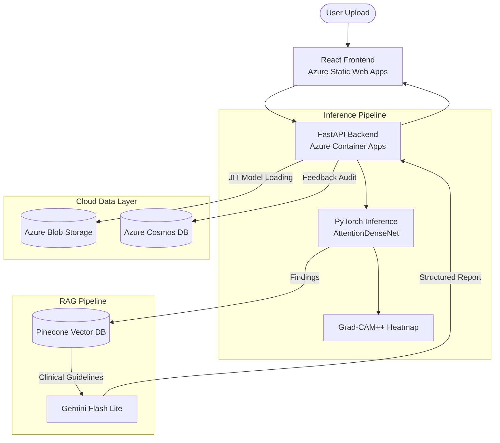

# PulmoLens: Enterprise-Grade Radiographic AI & RAG Pipeline

**PulmoLens** is a professional-grade medical AI application that integrates deep learning for radiographic classification with Retrieval-Augmented Generation (RAG) to provide clinical decision support. 

Designed for scalability and maintainability, the system features a decoupled architecture where vision-based diagnostic engines are grounded by real-time clinical guidelines.

> **Live Demo**: [https://victorious-sky-0836ce10f.3.azurestaticapps.net](https://victorious-sky-0836ce10f.3.azurestaticapps.net)

## 🚀 Key Technological Highlights

### 🧠 Vision Architecture (PyTorch)
- **Model**: Attention-based DenseNet121 trained on 100k+ CXR images.
- **Explainability**: Integrated **Grad-CAM++** for visual attention heatmapping, providing clinicians with a "visual why" behind every diagnosis.
- **Pathologies**: Supports 14 distinct radiographic findings (e.g., Pneumonia, Cardiomegaly, Infiltration).

### 🤖 Intelligent Orchestration (LangChain & RAG)
- **Retrieval Engine**: Uses **Pinecone** (Vector Database) and **Google Gemini Embeddings** to source clinical guidelines in real-time based on detected findings.
- **LLM Reasoning**: A **LangChain-orchestrated** pipeline powered by **Gemini Flash Lite** synthesizes vision results and clinical guidelines into a cohesive, structured clinical report.
- **Agentic Gates**: Implements deterministic confidence check-gates to trigger "Uncertainty Protocols" for indeterminate cases, adjusting the LLM's tone and guidance accordingly.

### ☁️ Cloud & MLOps (Azure)
- **Model Registry Pattern**: Implements **Just-In-Time (JIT)** weight loading. The Docker image is lightweight; heavy model weights (~500MB) are streamed from **Azure Blob Storage** via SAS URLs on startup.
- **Serverless Compute**: Hosted on **Azure Container Apps** with "Scale-to-Zero" enabled for cost-efficiency.
- **Static Frontend**: Deployed to **Azure Static Web Apps** for global CDN-backed delivery.
- **Infrastructure as Code (IaC)**: Fully reproducible environment defined via **Azure Bicep**.
- **Interoperability**: Implements the **Model Context Protocol (MCP)**, allowing AI agents to use the PulmoLens API as a native diagnostic tool.

---

## 🏗️ Architecture



## 🛠️ Tech Stack

| Layer          | Technologies |
|----------------|-------------|
| **Frontend**   | React, Vite, TailwindCSS, Lucide Icons |
| **Backend**    | FastAPI, LangChain, Pinecone, Google Gemini API |
| **Deep Learning** | PyTorch, Torchvision, Grad-CAM++ |
| **Infrastructure** | Azure Container Apps, Static Web Apps, Blob Storage, Cosmos DB, Bicep |

## 📂 Project Structure

```
pulmolens/
├── backend/            # FastAPI server, model loading, RAG pipeline
│   ├── api.py          # Core API endpoints (/predict, /health, /feedback, /mcp)
│   ├── model.py        # AttentionDenseNet architecture definition
│   ├── Dockerfile      # Container image build
│   └── requirements.txt
├── frontend/           # React frontend (Vite)
│   ├── src/
│   │   ├── api.ts      # Backend API client
│   │   ├── App.tsx     # Main application with step-based wizard UI
│   │   └── pages/      # Landing, Consent, Upload, Processing, Results
│   └── index.html
├── ml/                 # Model training scripts and utilities
├── infra/              # Azure Bicep IaC templates
└── scripts/            # Deployment and utility scripts
```

## 🚀 Getting Started

### Prerequisites
- Python 3.10+
- Node.js 18+
- Azure CLI (for cloud deployment)

### Local Development

```bash
# Backend
cd backend
pip install -r requirements.txt
uvicorn api:app --reload --port 8000

# Frontend (in a separate terminal)
cd frontend
npm install
npm run dev
```

### Environment Variables

| Variable | Description |
|----------|-------------|
| `MODEL_SAS_URL` | Azure Blob Storage SAS URL for model weight download |
| `GOOGLE_API_KEY` | Google Gemini API key for LLM & embeddings |
| `PINECONE_API_KEY` | Pinecone vector database API key |
| `COSMOS_ENDPOINT` | Azure Cosmos DB endpoint |
| `COSMOS_KEY` | Azure Cosmos DB access key |
| `STORAGE_CONN_STR` | Azure Blob Storage connection string |

## 📄 License & Disclaimer
*PulmoLens is a technical demonstration for a portfolio and is NOT a diagnostic medical device. It should not be used in a clinical setting.*
