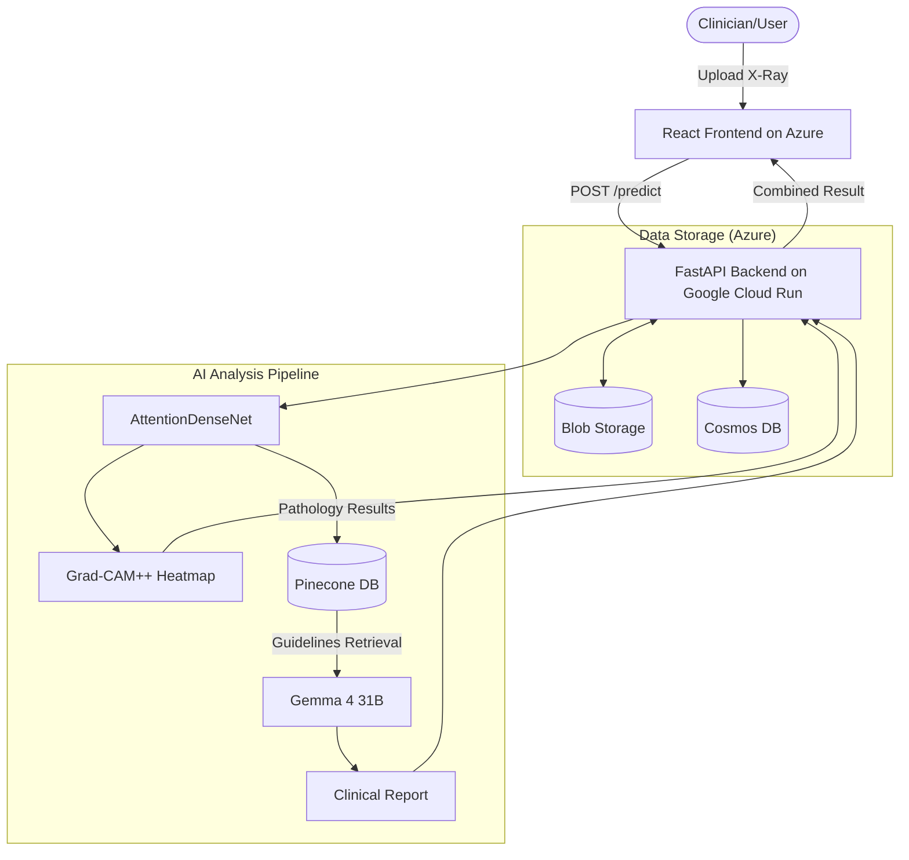

# PulmoLens: AI-Assisted Radiographic Diagnostic Pipeline

**PulmoLens** is a full-stack medical AI project built to demonstrate the integration of **Deep Learning (Vision)**, **Retrieval-Augmented Generation (RAG)**, and **Cloud Infrastructure**. 

It analyzes chest X-rays for 14 pathologies, provides visual explainability via attention heatmaps, and generates clinical report summaries grounded in official medical guidelines.

> **Live Demo**: [https://victorious-sky-0836ce10f.3.azurestaticapps.net](https://victorious-sky-0836ce10f.3.azurestaticapps.net)  
> *Note: This is a technical portfolio project, not a diagnostic medical device.*

---

## 📸 Project Showcase
*(Include screenshots of the Upload, Processing, and Results screens here)*

---

## 🛠️ Technical Highlights

### 🧠 1. Deep Learning & Explainability (Vision)
- **Computer Vision**: Custom **AttentionDenseNet** (DenseNet121 + CBAM) built in PyTorch to classify 14 different lung pathologies.
- **Explainability (Grad-CAM++)**: Instead of a "black box" prediction, the system generates visual heatmaps to show *exactly* where the model is looking on the X-ray.
- **Optimized Recall**: Per-class probability thresholds calibrated to minimize false negatives for critical findings like Pneumonia and Pneumothorax.

#### 📊 Model Performance Evaluation
The custom AttentionDenseNet model was evaluated on a held-out test set, achieving a **Mean AUC of 0.8511**.

```text
                    precision    recall  f1-score   support

       Atelectasis       0.24      0.82      0.37      1155
      Cardiomegaly       0.17      0.66      0.27       261
          Effusion       0.32      0.87      0.47      1369
      Infiltration       0.24      0.91      0.38      2129
              Mass       0.23      0.64      0.34       551
            Nodule       0.20      0.63      0.30       684
         Pneumonia       0.06      0.20      0.09       164
      Pneumothorax       0.27      0.72      0.40       549
     Consolidation       0.16      0.59      0.25       550
             Edema       0.14      0.67      0.23       248
         Emphysema       0.30      0.74      0.43       279
          Fibrosis       0.10      0.40      0.17       178
Pleural_Thickening       0.16      0.53      0.25       345
            Hernia       0.26      0.50      0.34        32

         micro avg       0.23      0.76      0.35      8494
         macro avg       0.20      0.63      0.31      8494
      weighted avg       0.23      0.76      0.35      8494
       samples avg       0.18      0.36      0.22      8494
```

### 🤖 2. RAG Pipeline & "Agentic" Logic
- **Clinical Grounding**: Built a RAG pipeline using **LangChain**, **Gemma 4 31B (Instruction Tuned)**, and **Pinecone**. It retrieves relevant sections from BTS and NICE clinical guidelines to back up every report.
- **Reasoning with Thinking Mode**: Leverages Gemma 4's built-in **Thinking Mode** to perform internal step-by-step cross-verification between vision findings and retrieved guidelines, minimizing hallucinations and ensuring expert-level clinical accuracy via native multimodality.

### ☁️ 3. Cloud-Native Deployment (Hybrid GCP/Azure)
- **Backend**: Containerized FastAPI (Python) on **Google Cloud Run** (Scale-to-Zero optimized, dynamically allocated memory & ports).
- **Frontend**: React (TypeScript) on **Azure Static Web Apps**.
- **Database**: **Azure Cosmos DB** (NoSQL) for audit logging and feedback loops.
- **Storage**: **Azure Blob Storage** for versioned model weights and clinical imaging.
- **Optimization**: The infrastructure is set to a lean, cost-efficient state with development and training data (50k+ images) archived to minimize overhead.
- **Model Registry Pattern**: Large model weights (~500MB) are streamed from **Azure Blob Storage** via time-limited SAS URLs during container boot, keeping Docker images lightweight and portable.
- **Infrastructure as Code (IaC)**: Deployments are automated using **Azure Bicep** and **GitHub Actions**.

### 🔌 4. The Future of AI Integration (MCP)
- **Model Context Protocol**: Native support for **MCP**, allowing Anthropic's Claude or other AI agents to use PulmoLens as a "tool" to analyze images directly via a base64 encoded string.

---

## 🏗️ Technical Architecture

This diagram illustrates how an image is processed: from the initial upload to the dual-pipeline analysis (Deep Learning + RAG) and finally to the expert clinical report.



---

## 🚀 Quick Setup

### 1. Prerequisites
- Python 3.10+
- Node.js 18+

### 2. Environment Setup
Create a `.env` in both `backend/` and `frontend/` folders using the provided `.env.example` templates. You'll need API keys for **Google Gemini**, **Pinecone**, and access to **Azure/GCP** for cloud features.

### 3. Local Run
```bash
# Run the Backend (Port 8000)
cd backend
pip install -r requirements.txt
uvicorn api:app --reload

# Run the Frontend (New Terminal)
cd frontend
npm install
npm run dev
```

---

## 📄 Repository Structure

- `/backend`: FastAPI service, model loading, and RAG logic.
- `/frontend`: React + TypeScript UI with beautiful glassmorphism design.
- `/ml`: Model architecture (PyTorch), training scripts, and evaluation utilities.
- `/infra`: Azure Bicep templates and deployment workflows.

---

## 👨‍💻 Author & Purpose

This project was built to explore the intersection of medical imaging and large language models (LLMs). It showcases my ability to build **end-to-end AI products**, from training a model to deploying a scalable, cloud-native application.

*PulmoLens is a technical demonstration and portfolio project. Contact me for specific questions about the architecture or implementation.*