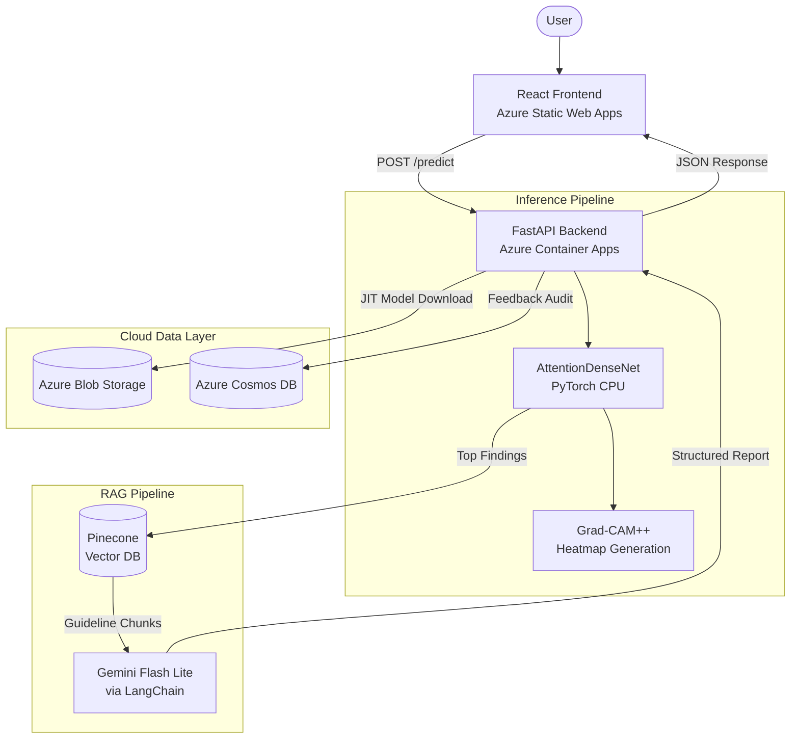

# PulmoLens: Enterprise-Grade Radiographic AI & RAG Pipeline

**PulmoLens** is a production-grade medical AI system that combines deep learning–based chest X-ray classification with Retrieval-Augmented Generation (RAG) to deliver structured clinical decision support. The system analyses radiographs for 14 pathologies, generates Grad-CAM++ attention heatmaps, and synthesises expert-level clinical reports grounded in published guidelines.

> **Live Demo**: [https://victorious-sky-0836ce10f.3.azurestaticapps.net](https://victorious-sky-0836ce10f.3.azurestaticapps.net)

---

## 🚀 Key Features

### 🧠 Vision Pipeline (PyTorch)
- **AttentionDenseNet**: Custom DenseNet121 architecture enhanced with CBAM (Convolutional Block Attention Module) — channel + spatial attention applied after each dense block.
- **14 Pathologies**: Atelectasis, Cardiomegaly, Effusion, Infiltration, Mass, Nodule, Pneumonia, Pneumothorax, Consolidation, Edema, Emphysema, Fibrosis, Pleural Thickening, Hernia.
- **Explainability**: Integrated **Grad-CAM++** generates visual attention heatmaps overlaid on the original CXR, providing a "visual why" behind every prediction.
- **Threshold Calibration**: Per-class confidence thresholds (e.g., Hernia: 0.72, Pneumonia: 0.44) tuned to optimise sensitivity vs. specificity.

### 🤖 RAG Pipeline (LangChain + Gemini)
- **Document Ingestion**: Clinical guideline PDFs (BTS, NICE) are chunked via `RecursiveCharacterTextSplitter` and embedded using **Google Gemini Embeddings** (`gemini-embedding-2-preview`).
- **Vector Store**: Embeddings stored in **Pinecone** for low-latency semantic retrieval.
- **LLM Synthesis**: **Gemini Flash Lite** generates structured clinical reports with sections: *Radiographic Signature*, *Clinical Management*, and *Patient Summary*.
- **Agentic Confidence Gate**: When the top prediction confidence is < 50%, the system triggers an "Uncertainty Protocol" — switching the LLM's tone from authoritative to cautious and recommending further clinical correlation.

### ☁️ Cloud Architecture (Azure)
- **Model Registry Pattern**: The Docker image is lightweight (~200MB code); the 500MB PyTorch model weights are streamed from **Azure Blob Storage** via time-limited SAS URLs at container startup.
- **Serverless Backend**: Hosted on **Azure Container Apps** (1 vCPU, 2GB RAM, scale-to-zero) with images built and stored in **Azure Container Registry**.
- **Static Frontend**: Deployed to **Azure Static Web Apps** with global CDN delivery.
- **Feedback Loop**: User feedback (thumbs up/down + optional notes) is persisted to **Azure Cosmos DB** with the associated image uploaded to Blob Storage.
- **Infrastructure as Code**: Azure Bicep templates for reproducible provisioning of storage, container apps, and log analytics.

### 🔌 Interoperability
- **Model Context Protocol (MCP)**: Exposes `/mcp/tools` and `/mcp/analyze` endpoints, allowing AI agents (e.g., Claude Desktop) to invoke PulmoLens as a native diagnostic tool via base64-encoded images.

---

## 🏗️ Architecture



---

## 🛠️ Tech Stack

| Layer              | Technologies                                                       |
|--------------------|--------------------------------------------------------------------|
| **Frontend**       | React 18, TypeScript, Vite, TailwindCSS, Lucide Icons              |
| **Backend**        | FastAPI, LangChain, Pinecone, Google Gemini API, Uvicorn           |
| **Deep Learning**  | PyTorch, Torchvision (DenseNet121), Grad-CAM++, CBAM Attention     |
| **Infrastructure** | Azure Container Apps, Static Web Apps, Blob Storage, Cosmos DB, ACR, Bicep |

---

## 📂 Project Structure

```
pulmolens/
├── backend/
│   ├── api.py               # FastAPI application — /predict, /health, /feedback, /mcp endpoints
│   ├── model.py              # AttentionDenseNet & CBAM architecture definition
│   ├── ingest_docs.py        # PDF → Pinecone ingestion pipeline (one-time setup)
│   ├── query_cosmos.py       # Utility to query Cosmos DB feedback entries
│   ├── Dockerfile            # Container image (model weights loaded at runtime)
│   ├── requirements.txt      # Python dependencies
│   └── data/
│       ├── clinical_guidelines.txt
│       └── pdfs/             # Source PDFs for RAG vector store
├── frontend/
│   ├── src/
│   │   ├── App.tsx           # Main wizard UI (Landing → Consent → Upload → Processing → Results)
│   │   ├── api.ts            # Backend API client (uploadAndAnalyze, submitFeedback)
│   │   ├── data/constants.ts # Labels, thresholds, clinician copy, guideline tags
│   │   ├── pages/            # Landing, About, Consent, UploadPanel, Processing, Results
│   │   └── components/       # Header, Footer, Stepper, ReportPanel, SafetyNet, etc.
│   ├── index.html            # Entry point with favicon
│   ├── vite.config.ts        # Vite build configuration
│   └── staticwebapp.config.json  # Azure SWA routing rules
├── ml/
│   ├── train.py              # Training script (AttentionDenseNet + AsymmetricLoss)
│   └── src/                  # Training utilities (dataset, losses, config, evaluation)
├── infra/
│   ├── main.bicep            # Root Bicep template (resource group, modules)
│   ├── aca.bicep             # Container App + ACR + Log Analytics
│   └── storage.bicep         # Storage account
└── scripts/
    └── cleanup_azure.ps1     # Orphaned resource cleanup utility
```

---

## 🚀 Getting Started

### Prerequisites
- Python 3.10+
- Node.js 18+
- Azure CLI (for cloud deployment)

### Local Development

```bash
# Backend
cd backend
pip install -r requirements.txt
# Place model weights at ../ml/models/attention_densenet_asl_20251121_213351_best.pth
uvicorn api:app --reload --port 8000

# Frontend (separate terminal)
cd frontend
npm install
npm run dev
```

### Environment Variables

| Variable          | Description                                          |
|-------------------|------------------------------------------------------|
| `MODEL_SAS_URL`   | Azure Blob Storage SAS URL for model weight download |
| `GOOGLE_API_KEY`  | Google Gemini API key (LLM + embeddings)             |
| `PINECONE_API_KEY` | Pinecone vector database API key                    |
| `COSMOS_ENDPOINT` | Azure Cosmos DB endpoint URL                         |
| `COSMOS_KEY`      | Azure Cosmos DB primary key                          |
| `STORAGE_CONN_STR`| Azure Blob Storage connection string                 |

### Deploying

```bash
# Build & push backend container
az acr build --registry <acr-name> --image pulmolens-container:latest backend/

# Update Container App
az containerapp update --name <app-name> --resource-group <rg> --image <acr>.azurecr.io/pulmolens-container:latest

# Build & deploy frontend
cd frontend && npm run build
npx @azure/static-web-apps-cli deploy ./dist --deployment-token <token> --env production
```

---

## 📄 License & Disclaimer

*PulmoLens is a technical demonstration and portfolio project. It is NOT a diagnostic medical device and should not be used for clinical decision-making.*
