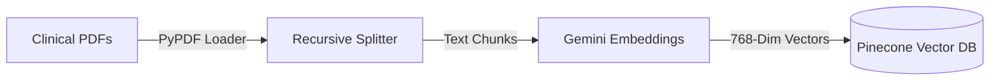

# PulmoLens: AI-Assisted Radiographic Diagnostic Pipeline

**PulmoLens** is a full-stack medical AI project built to demonstrate the integration of **Deep Learning (Vision)**, **Retrieval-Augmented Generation (RAG)**, and **Cloud Infrastructure**. 

It analyzes chest X-rays for 14 pathologies, provides visual explainability via attention heatmaps, and generates clinical report summaries grounded in official medical guidelines.

> **Live Demo**: [https://victorious-sky-0836ce10f.3.azurestaticapps.net](https://victorious-sky-0836ce10f.3.azurestaticapps.net)  
> *Note: This is a technical portfolio project, not a diagnostic medical device.*

---

## 📸 Project Showcase
*(Include screenshots of the Upload, Processing, and Results screens here)*

---

## 🛠️ Technical Highlights

### 🧠 1. Deep Learning & Explainability (Vision)
- **Computer Vision**: Custom **AttentionDenseNet** (DenseNet121 + CBAM) built in PyTorch to classify 14 different lung pathologies.
- **Explainability (Grad-CAM++)**: Instead of a "black box" prediction, the system generates visual heatmaps to show *exactly* where the model is looking on the X-ray.
- **Optimized Recall**: Per-class probability thresholds calibrated to minimize false negatives for critical findings like Pneumonia and Pneumothorax.

### 🤖 2. RAG Pipeline & "Agentic" Logic
- **Clinical Grounding**: Built a RAG pipeline using **LangChain**, **Google Gemini**, and **Pinecone**. It retrieves relevant sections from BTS and NICE clinical guidelines to back up every report.
- **Uncertainty Protocol**: Implemented a logic gate where the system detects low-confidence predictions and automatically shifts its tone to a "cautious consultant," recommending further clinical correlation.

### ☁️ 3. Cloud-Native Architecture (Azure)
- **Serverless Backend**: FASTApi hosted on **Azure Container Apps** for rapid scaling and cost-efficiency.
- **Model Registry Pattern**: Large model weights (~500MB) are streamed from **Azure Blob Storage** via time-limited SAS URLs during container boot, keeping Docker images lightweight and portable.
- **Infrastructure as Code (IaC)**: Deployments are fully reproducible using **Azure Bicep** templates for storage, logs, and compute.

### 🔌 4. The Future of AI Integration (MCP)
- **Model Context Protocol**: Native support for **MCP**, allowing Anthropic's Claude or other AI agents to use PulmoLens as a "tool" to analyze images directly via a base64 encoded string.

---

## 🏗️ Technical Architecture

### 1. Request-Response Workflow (Inference)
This diagram illustrates the real-time path an image takes from upload to the final clinical report.

```mermaid
graph TD
    User([Clinician]) -->|Upload Image| FE[React Frontend]
    FE -->|POST /predict| BE[FastAPI Backend]
    
    subgraph Cloud Infrastructure (Azure)
        BE -->|JIT Model Download| BLOB[(Azure Blob Storage)]
        BE -->|Audit Feedback| COSMOS[(Azure Cosmos DB)]
    end
    
    subgraph AI Inference Pipeline
        BE -->|Preprocessing| MODEL[AttentionDenseNet]
        MODEL -->|14 Pathologies| PROBS[Probability Tensor]
        MODEL -->|Features| CAM[Grad-CAM++]
        CAM -->|Overlay| HEATMAP[Attention Heatmap]
    end
    
    subgraph RAG Pipeline (LangChain)
        PROBS -->|Top Findings| PINDEX[(Pinecone DB)]
        PINDEX -->|Guideline Chunks| LLM[Gemini Flash Lite]
        LLM -->|Expert Report| REPORT[Structured Synthesis]
    end
    
    REPORT --> BE
    HEATMAP --> BE
    BE -->|Combined AI Result| FE
```

### 2. Document Ingestion Pipeline (One-Time Setup)
How medical guidelines are processed into the vector database.



---

## 🚀 Quick Setup

### 1. Prerequisites
- Python 3.10+
- Node.js 18+

### 2. Environment Setup
Create a `.env` in both `backend/` and `frontend/` folders using the provided `.env.example` templates. You'll need API keys for **Google Gemini**, **Pinecone**, and access to **Azure** for cloud features.

### 3. Local Run
```bash
# Run the Backend (Port 8000)
cd backend
pip install -r requirements.txt
uvicorn api:app --reload

# Run the Frontend (New Terminal)
cd frontend
npm install
npm run dev
```

---

## 📄 Repository Structure

- `/backend`: FastAPI service, model loading, and RAG logic.
- `/frontend`: React + TypeScript UI with beautiful glassmorphism design.
- `/ml`: Model architecture (PyTorch), training scripts, and evaluation utilities.
- `/infra`: Azure Bicep templates for zero-touch infrastructure setup.

---

## 👨‍💻 Author & Purpose

This project was built to explore the intersection of medical imaging and large language models (LLMs). It showcases my ability to build **end-to-end AI products**, from training a model to deploying a scalable, cloud-native application.

*PulmoLens is a technical demonstration and portfolio project. Contact me for specific questions about the architecture or implementation.*
