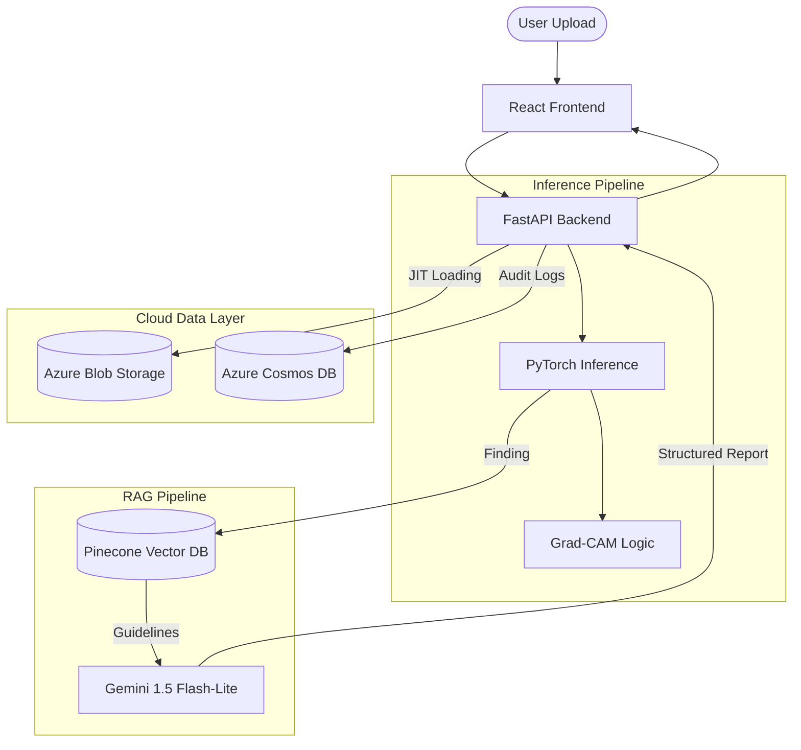

# PulmoLens: Enterprise-Grade Radiographic AI & RAG Pipeline

**PulmoLens** is a professional-grade medical AI application that integrates deep learning for radiographic classification with Retrieval-Augmented Generation (RAG) to provide clinical decision support. 

Designed for scalability and maintainability, the system features a decoupled architecture where vision-based diagnostic engines are grounded by real-time clinical guidelines.

## 🚀 Key Technological Highlights

### 🧠 Vision Architecture (PyTorch)
- **Model**: Attention-based DenseNet121 trained on 100k+ CXR images.
- **Explainability**: Integrated **Grad-CAM++** for visual attention heatmapping, providing clinicians with a "visual why" behind every diagnosis.
- **Pathologies**: Supports 14 distinct radiographic findings (e.g., Pneumonia, Cardiomegaly, Infiltration).

### 🤖 Intelligent Orchestration (LangChain & RAG)
- **Retrieval Engine**: Uses **Pinecone** (Vector Database) and **Gemini Embeddings** to source clinical guidelines in real-time based on detected findings.
- **Reasoning**: A **LangChain-orchestrated** agent synthesizes vision results and clinical text into a cohesive report for physicians.
- **Agentic Gates**: Implements deterministic check-gates to analyze prediction confidence and trigger "Uncertainty Protocols" for indeterminate cases.

### ☁️ Cloud & MLOps (Azure)
- **Model Registry Pattern**: Implements **Just-In-Time (JIT)** weight loading. The Docker image is lightweight (~200MB); heavy model weights are streamed from **Azure Blob Storage** via SAS URLs on startup.
- **Serverless Compute**: Hosted on **Azure Container Apps** with "Scale-to-Zero" enabled for cost-efficiency.
- **Infrastructure as Code (IaC)**: Fully reproducible environment defined via **Azure Bicep**.
- **Interoperability**: Implements the **Model Context Protocol (MCP)**, allowing AI agents to use the PulmoLens API as a native diagnostic tool.

---

## 🏗️ The Architecture

## 🛠️ Tech Stack
- **Frontend**: React, Vite, TailwindCSS, Lucide Icons.
- **Backend**: FastAPI, LangChain, Pinecone, Google Gemini API.
- **Deep Learning**: PyTorch, Torchvision, Grad-CAM.
- **Infrastructure**: Azure (Container Apps, Static Web Apps, Blob Storage, Bicep).

## 📄 License & Disclaimer
*PulmoLens is a technical demonstration for a portfolio and is NOT a diagnostic medical device. It should not be used in a clinical setting.*
