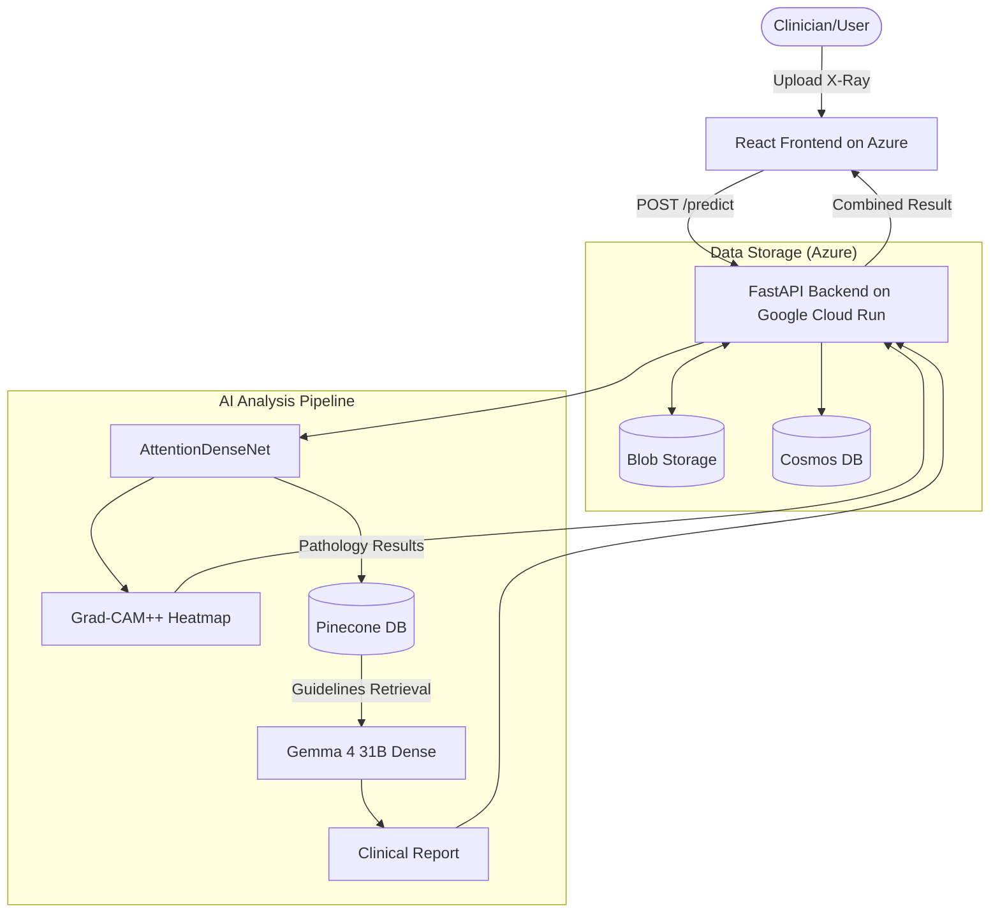

# PulmoLens: AI-Assisted Radiographic Diagnostic Pipeline

**PulmoLens** is a full-stack medical AI project built to demonstrate the integration of **Deep Learning (Vision)**, **Retrieval-Augmented Generation (RAG)**, and **Cloud Infrastructure**. 

It analyzes chest X-rays for 14 pathologies, provides visual explainability via attention heatmaps, and generates clinical report summaries grounded in official medical guidelines.

> **Live Demo**: [https://victorious-sky-0836ce10f.3.azurestaticapps.net](https://victorious-sky-0836ce10f.3.azurestaticapps.net)  
> *Note: This is a technical portfolio project, not a diagnostic medical device.*

---

## 📸 Project Showcase
*(Include screenshots of the Upload, Processing, and Results screens here)*

---

## 🛠️ Technical Highlights

### 🧠 1. Deep Learning & Explainability (Vision)
- **Computer Vision**: Custom **AttentionDenseNet** (DenseNet121 + CBAM) built in PyTorch to classify 14 different lung pathologies.
- **Explainability (Grad-CAM++)**: Instead of a "black box" prediction, the system generates visual heatmaps to show *exactly* where the model is looking on the X-ray.
- **Optimized Recall**: Per-class probability thresholds calibrated to minimize false negatives for critical findings like Pneumonia and Pneumothorax.

#### 📊 Model Performance Evaluation
The custom AttentionDenseNet model was evaluated on a held-out test set, achieving a **Mean AUC of 0.8511**.

```text
                    precision    recall  f1-score   support

       Atelectasis       0.24      0.82      0.37      1155
      Cardiomegaly       0.17      0.66      0.27       261
          Effusion       0.32      0.87      0.47      1369
      Infiltration       0.24      0.91      0.38      2129
              Mass       0.23      0.64      0.34       551
            Nodule       0.20      0.63      0.30       684
         Pneumonia       0.06      0.20      0.09       164
      Pneumothorax       0.27      0.72      0.40       549
     Consolidation       0.16      0.59      0.25       550
             Edema       0.14      0.67      0.23       248
         Emphysema       0.30      0.74      0.43       279
          Fibrosis       0.10      0.40      0.17       178
Pleural_Thickening       0.16      0.53      0.25       345
            Hernia       0.26      0.50      0.34        32

         micro avg       0.23      0.76      0.35      8494
         macro avg       0.20      0.63      0.31      8494
      weighted avg       0.23      0.76      0.35      8494
       samples avg       0.18      0.36      0.22      8494
```

### 🤖 2. RAG Pipeline & "Agentic" Logic
- **Clinical Grounding**: Built a RAG pipeline using **LangChain**, **Google Gemma 4 (31B Dense)**, and **Pinecone**. It retrieves relevant sections from BTS, NICE, AHA/ACC, and Fleischner clinical guidelines to back up every report.
- **Reasoning with Thinking Mode**: Leverages Gemma 4's **built-in reasoning mode** to perform internal cross-verification between vision findings and retrieved guidelines, minimizing hallucinations and ensuring expert-level accuracy.
- **Trustworthy Citations**: Retrieved guideline chunks are post-filtered against the primary finding before being shown to the user. If no doc actually mentions the pathology, the sources list is empty rather than misleading, and the model is explicitly prompted to fall back to standard radiology in that case.
- **Heatmap-Grounded Reasoning**: The Gemma 4 prompt requires the model to first identify which anatomical region the Grad-CAM overlay highlights, then state whether it matches the expected location for the predicted pathology. If they disagree, the model lowers diagnostic confidence in its Patient Summary instead of rubber-stamping.

### 🧪 3. Multimodal LLM Eval Harness with Cross-Family Judge
A reproducible regression suite for the LLM stage, designed to catch prompt drift, prompt leakage, hallucinated drug doses, and clinically unsafe phrasing **before** they reach users.

**Testing process used to verify Gemma 4:**

1. **Deterministic input fixtures.** Twelve hand-crafted `SummarizeRequest` payloads in [`backend/evals/cases.py`](backend/evals/cases.py) cover high-confidence single findings, urgent life-threats (Pneumothorax, acute Edema), oncology workup (Mass), multi-finding mixes, the sub-threshold short-circuit path, just-above-threshold edges, and rare pathologies that exercise the knowledge-fallback rule (Hernia is intentionally absent from the indexed guidelines). Each case ships with expected primary finding, urgency flag, and case-specific keyword expectations.
2. **Tier 1 (deterministic asserts).** Each report from `/summarize` runs through cheap regex and substring checks: required section headers present, primary finding mentioned, no internal scaffolding leakage (`INTERNAL DATA`, `RELEVANT_GUIDELINES`, `KNOWLEDGE FALLBACK`, etc), no forbidden phrases per case. These are free, run in seconds, and catch the obvious prompt-leak and structural regressions.
3. **Tier 2 (LLM-as-judge).** Cases that pass Tier 1 are scored by **Qwen3.6-Plus** via OpenRouter. Qwen is a different model family from Gemma, which prevents the same-family rubber-stamping observed when Gemma judged its own outputs. The judge runs a forced-decomposition rubric: it must independently identify the visible heatmap region before being allowed to judge whether the report's claim about that region is consistent. It also flags hallucinated drug doses, prompt scaffolding leakage, missing sections, urgency tone for life-threatening findings, and scope-creep into commitment language.
4. **Verdict and gating.** The runner aggregates Tier 1 and Tier 2 results. Exit code is non-zero on any keyword failure or judge `verdict: FAIL`, which makes the suite directly CI-droppable.
5. **Iteration loop.** When a case fails, the surfaced reason (e.g. "report commits to initiating treatment", "uses educational language for an urgent finding") feeds directly back into the `/summarize` prompt in [`backend/api.py`](backend/api.py). Two real prompt-quality issues caught this way (treatment-scope creep, weak urgency language for life-threats) became explicit rules in the prompt. The judge backend is env-driven (`JUDGE_BACKEND=openrouter|gemini`, `JUDGE_MODEL=...`), so any multimodal LLM can be A/B tested on the same fixtures without code changes.

The full 12-case suite runs in roughly three minutes against a local backend. See [`backend/evals/`](backend/evals/) for cases, asserts, judge rubric, and the runner.

### ☁️ 4. Cloud-Native Deployment (Hybrid GCP/Azure)
- **Backend**: Containerized FastAPI (Python) on **Google Cloud Run** (Scale-to-Zero optimized, dynamically allocated memory & ports).
- **Frontend**: React (TypeScript) on **Azure Static Web Apps**.
- **Database**: **Azure Cosmos DB** (NoSQL) for audit logging and feedback loops.
- **Storage**: **Azure Blob Storage** for versioned model weights and clinical imaging.
- **Optimization**: The infrastructure is set to a lean, cost-efficient state with development and training data (50k+ images) archived to minimize overhead.
- **Model Registry Pattern**: Large model weights (~500MB) are streamed from **Azure Blob Storage** via time-limited SAS URLs during container boot, keeping Docker images lightweight and portable.
- **Infrastructure as Code (IaC)**: Deployments are automated using **Azure Bicep** and **GitHub Actions**.

### 🔌 5. The Future of AI Integration (MCP)
- **Model Context Protocol**: Native support for **MCP**, allowing Anthropic's Claude or other AI agents to use PulmoLens as a "tool" to analyze images directly via a base64 encoded string.

---

## 🏗️ Technical Architecture

This diagram illustrates how an image is processed: from the initial upload to the dual-pipeline analysis (Deep Learning + RAG) and finally to the expert clinical report.



---

## 🚀 Quick Setup

### 1. Prerequisites
- Python 3.10+
- Node.js 18+

### 2. Environment Setup
Create a `.env` in both `backend/` and `frontend/` folders using the provided `.env.example` templates. You'll need API keys for **Gemma 4 (Google AI)**, **Pinecone**, and access to **Azure/GCP** for cloud features. To run the LLM eval harness, also add an `OPENROUTER_API_KEY`. This key is used only by `backend/evals/`, not by production.

### 3. Local Run
```bash
# Run the Backend (Port 8000)
cd backend
pip install -r requirements.txt
uvicorn api:app --reload

# Run the Frontend (New Terminal)
cd frontend
npm install
npm run dev
```

### 4. Run the LLM Eval Harness
```bash
# In a separate terminal, with the backend running:
cd backend
python -m evals.run_evals               # full 12-case suite with judge
python -m evals.run_evals --no-judge    # deterministic asserts only (free)
python -m evals.run_evals --case rare_hernia_fallback   # single case
```

---

## 📄 Repository Structure

- `/backend`: FastAPI service, model loading, and RAG logic.
- `/backend/evals`: LLM regression suite. Test cases, keyword asserts, multimodal Qwen3.6-Plus judge, and runner.
- `/frontend`: React + TypeScript UI with beautiful glassmorphism design.
- `/ml`: Model architecture (PyTorch), training scripts, and evaluation utilities.
- `/infra`: Azure Bicep templates and deployment workflows.

---

## 👨‍💻 Author & Purpose

This project was built to explore the intersection of medical imaging and large language models (LLMs). It showcases my ability to build **end-to-end AI products**, from training a model to deploying a scalable, cloud-native application.

*PulmoLens is a technical demonstration and portfolio project. Contact me for specific questions about the architecture or implementation.*