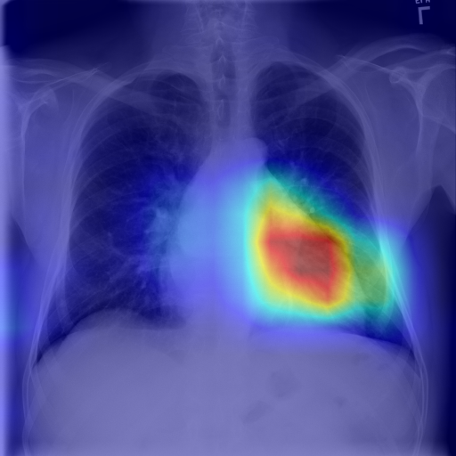
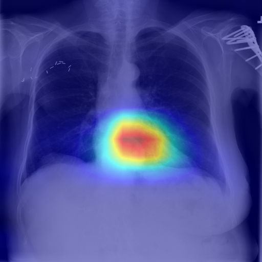

# Evaluation Results

This directory contains the performance metrics and visualizations for the Pulmolens model.

## 📊 Performance Metrics

**Test Set Evaluation**:
- **Weighted Recall**: **0.50** (High sensitivity)
- **Weighted Precision**: 0.35
- **Weighted F1-Score**: 0.41

### Detailed Classification Report
See `test_evaluation.txt` for the full per-class breakdown.

## 👁️ Visualizations (Grad-CAM++)

We use Grad-CAM++ to visualize the regions of the X-ray that the model focuses on to make its predictions.

### Case 1: Cardiomegaly
**Prediction**: Cardiomegaly (Conf: 0.72)

*The model correctly focuses on the enlarged heart region.*

### Case 2: Hernia
**Prediction**: Hernia (Conf: 0.90)

*The model identifies the abnormality in the diaphragm area.*

## Files
- `test_evaluation.txt`: Full classification report.
- `optimal_thresholds.json`: Optimized decision thresholds for each class to maximize F1-score.
- `gradcam_*.png`: Generated heatmaps.
